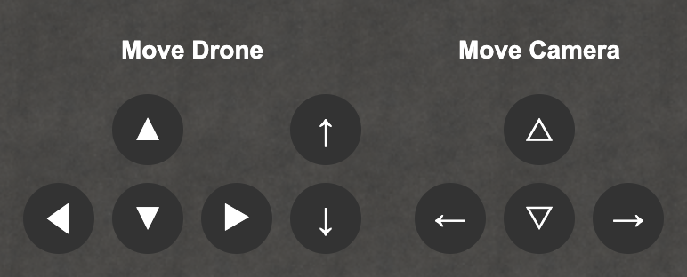
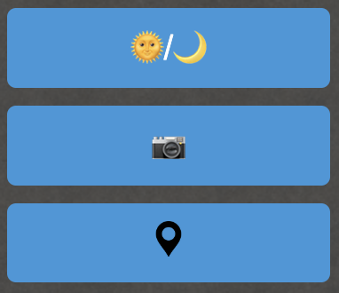
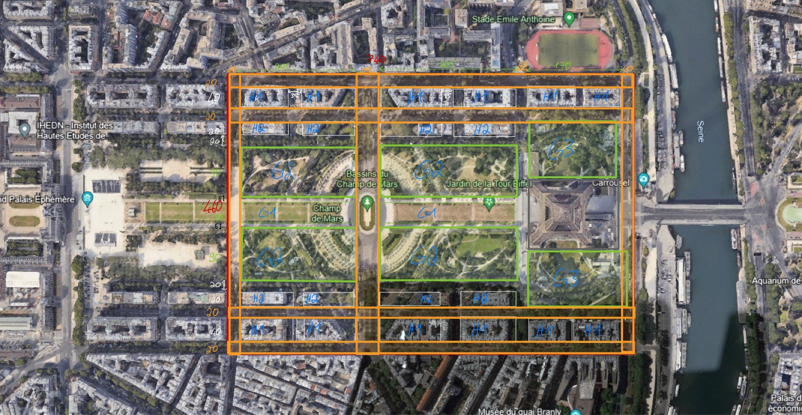
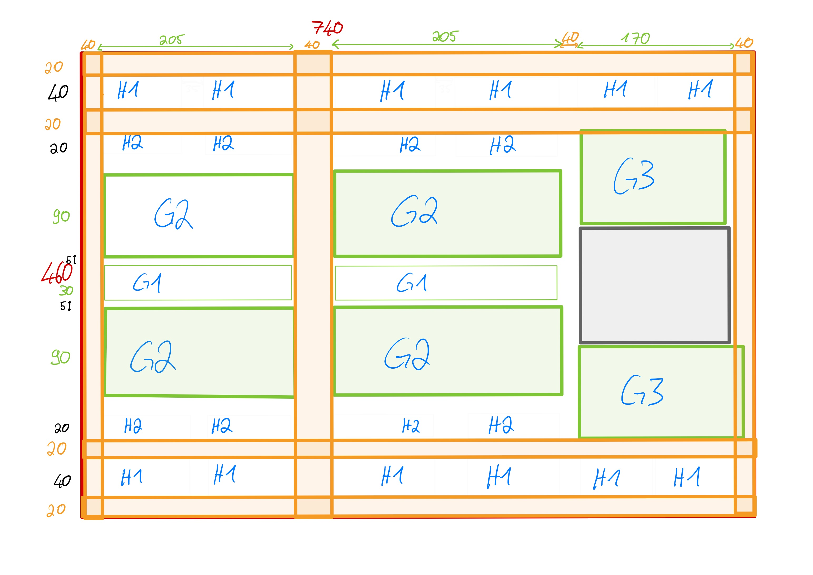
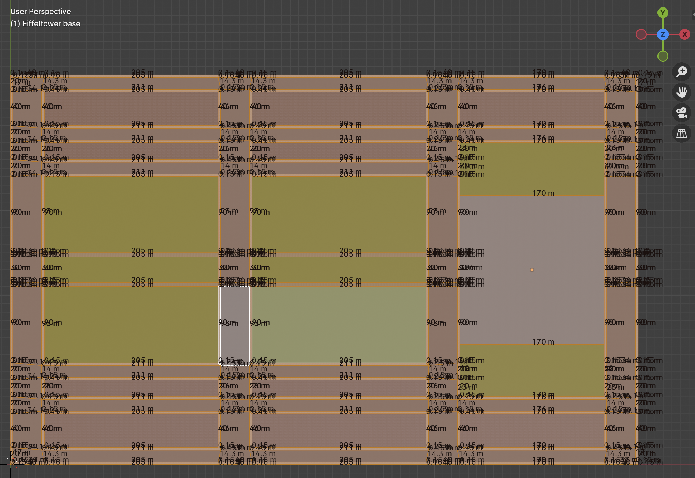

# CG Doku
- [Installation](#installation)
- [Bedienung](#bedienung)
- [Weitere Interaktionsmöglichkeiten](#interaktionen)

---

<a name="installation"></a>
## Installation
Um die Anwendung lokal auf dem Gerät laufen zu lassen, müssen Sie die
folgenden Schritte durchführen:
1. Repository klonen/Code herunterladen
2. Dependencies installieren
3. Anwendung starten durch den Befehl `npm start`

Anschließend wird in der Konsole eine URL ausgegeben, unter der die
Anwendung erreichbar ist. Diese URL kann dann in einem beliebigen
Browser geöffnet werden.

<a name="bedienung"></a>
## Bedienung
Zu Beginn der Anwendung wird der Nutzer in der Szene platziert. Anschließend
hat der Nutzer die Möglichkeit, sich in der Szene umher zu bewegen. Dazu bieten
sich zwei Möglichkeiten:
* Tastatur & Maus
* Buttons im User Interface
### Tastatur & Maus
Um sich mit Hilfe der Tastatur und Maus in der Szene zu bewegen, muss der Nutzer
zuerst einmal auf die Szene klicken. Dadurch wird die Steuerung gesperrt. 
Anschließend kann der Nutzer sich mit der Hilfe der Tasten WASD in der Szene
bewegen. Dabei bewegt sich der Nutzer in die Richtung, in die er schaut.
Die Tasten R und F ermöglichen es, sich nach oben und unten zu bewegen.
Für die Bewegung der Blickrichtung gibt es wiederum 2 Möglichkeiten:
* Maus
* Pfeiltasten

Um die Steuerung mit der Hilfe der Tastatur wieder zu verlassen, muss nur wieder
mit der Maus geklickt werden. Dadurch wird auch der Mauszeiger wieder sichtbar und 
Buttons können wieder angeklickt werden.

### Buttons im User Interface
Alternativ zur Steuerung mit der Tastatur und Maus kann der Nutzer auch die Buttons
im User Interface verwenden. Dieses ist unten abgebildet. Durch klicken auf diese Buttons kann sich der Nutzer
in allen Bewegungsrichtungen frei bewegen.


<a name="interaktionen"></a>
## Weitere Interaktionsmöglichkeiten
Zusätzlich zur Steuerung der Drohne kann der Nutzer auch noch weitere Aktionen
ausführen. Diese sind im Folgenden aufgelistet:
* Tag/Nacht-Wechsel
* Wechsel der Kamera
* Drohne auf Startpositon setzen
* 

### Tag/Nacht-Wechsel
Durch das Klicken auf den Button `Day/Night` kann der Nutzer zwischen Tag und Nacht
wechseln. Dabei wird die Szene entsprechend angepasst. Zum einen wird
die Umgebung auf einen Sternenhimmel bzw. einen Himmel mit Wolken geändert.
Zum anderen ändert sich die Beleuchtung der Szene. Während tagsüber eine
Sonne die Szene beleuchtet, sorgen nachts einzelne, über die Szene verteilte 
Lichtquellen für die Beleuchtung.

### Wechsel der Kamera
Durch das Klicken auf den Button `Camera` kann der Nutzer zwischen den
verfügbaren Kameras hin und her wechseln. Dabei wird die aktuelle Kamera
deaktiviert und die nächste Kamera aktiviert. Die verfügbaren Kameras sind:
* Drohnenkamera
* Debugkamera
* Stationäre Kamera

Dabei ist anzumerken, dass der Nutzer sich ausschließlich mit der Drohnenkamera
in der Szene bewegen kann. Die anderen Kameras sind lediglich dazu da, um
die Szene aus verschiedenen Perspektiven betrachten zu können. Die 
Debugkamera ist dabei so platziert, dass die gesamte Szene auf einmal
zu sehen ist. Die Stationäre Kamera bietet einen realistischen Ausblick auf den
Eiffelturm.

### Drohne auf Startposition setzen
Durch den letzten Button kann die Drohnenkamera wieder auf die Startposition
gesetzt werden. Dies ist vor allem dann hilfreich, wenn der Nutzer sich
in der Szene verirrt hat und nicht mehr weiß, wo er sich befindet.

<a name="idee"></a>
## Idee
Begonnen hat alles mit der ersten Idee. Unser Ziel war es, den Eiffelturm 
sowie die nähere Umgebung möglichst originalgetreu
nachzubilden. Das Kernstück ist dabei ganz klar der Eiffelturm gewesen, 
weswegen die Suche nach passenden Modellen auch damit begonnen hat.

Gleichzeitig wollten wir aber auch die Umgebung möglichst realistisch und
in einem realistischen Maßstab darstellen. Das bedeutet, dass wir uns
Satellitenaufnahmen der Umgebung herausgesucht haben und diese dann
vermessen haben, um die Maße der Umgebung zu bestimmen. Das Ergebnis
dieser Vermessung ist in den folgenden Abbildungen zu sehen.


Das Ziel war es somit, eine Fläche von 460*740 metern nachzubilden.

<a name="modellierung"></a>
## Modellierung
### Umgebung
Begonnen haben wir damit, den Bodenbereich zu modellieren. Dazu haben wir
eine Ebene erstellt und ebenso wie auf dem Bild zu sehen, die Umrisse der
Umgebung nachgezeichnet. Diese Ebene war somit anschließend eingeteilt in:
* Straße
* Grünfläche
* Gehweg
* Wohngebiet
* Platz für Eiffelturm

Anschließend haben wir die einzelnen Bereiche mit Texturen versehen, um diese
auch optisch voneinander abgrenzen zu können. Das Ergebnis ist in der folgenden
Abbildung zu sehen.


### Eiffelturm
Der nächste Schritt bestand daraus, ein passendes Modell für den Eiffelturm zu finden.
Als diese gefunden war bestand die Aufgabe darin, diesen auf der Ebene passend 
zu platzieren.

### Bäume
Bis jetzt war ausschließlich der Eiffelturm auf der Ebene zu sehen. Um die Umgebung
zu erweitern haben wir als nächstes Bäume auf den Grünflachen des Parks platziert.

### Häuser

### Autos

### Vögel

<a name="einbindungThreejs"></a>
## Einbindung der Modelle in three.js

<a name="animation"></a>
## Animation
Um die Szene lebendiger wirken zu lassen, mussten Animationen in die Szene eingebaut werden.
Dabei haben wir uns auf zwei Arten von Animationen fokussiert. 
Zum einen haben wir die Animationen der Autos, die sich auf den Straßen
von Paris hin und her fahren.
Zum anderen haben wir die Animationen der Vögel, die sich in der Luft bewegen
und dabei ihre Flügel bewegen.

### Autos
Insgesamt wurden 6 Autos in der Szene platziert. Mit der Hilfe von Keyframes
haben wir die Autos auf den Straßen hin und her fahren lassen. Dabei haben
wir darauf geachtet, dass die Autos nicht zu schnell fahren, damit die
Animation nicht zu unrealistisch wirkt.

Umgesetzt haben wir das ganze mit einer JSON-Datei, in der wir die einzelnen
Keyframes mit den Positionen und Rotationen definiert haben. 
Diese Datei wird bei Start der Szene aufgerufen und so dynamisch die Autos erzeugt.
Das heißt es ist nicht fest in den Code eingebaut, wie viele Fahrezuge dargestellt werden,
sondern es wird die Anzahl der Autos aus der JSON-Datei ausgelesen und dann 
dementsprechend viele Autos erzeugt.

Diese JSON-Datei sieht folgendermaßen aus:
```
{
  "0": {
    "rotation": [0, 0, 0.5, 1, 1, 1.5, 2],
    "time": [0, 25, 27.5, 30, 45, 47.5, 50],
    "positions": [255, 0, -450, 255, 0, -10, 265, 0, -10, 275, 0, -10, 275, 0, -450, 265, 0, -450, 255, 0, -450]
  },
  "1": {
    "rotation": [1, 1, 1.5, 2, 0, 0.5, 1],
    "time": [0, 20, 22.5, 25, 45, 47.5, 50],
    "positions": [275, 0, -10, 275, 0, -450, 265, 0, -450, 255, 0, -450, 255, 0, -10, 265, 0, -10 ,275, 0, -10]
  },
  "2": {
    "rotation": [0, 0, 0.5, 1, 1, 1.5, 2],
    "time": [0, 22.5, 25, 27.5, 52.5, 55, 57.5],
    "positions": [10, 0, -450, 10, 0, -10, 20, 0, -10, 30, 0, -10, 30, 0, -450, 20, 0, -450, 10, 0, -450]
  },
  "3": {
    "rotation": [1, 1, 1.5, 2, 0, 0.5, 1],
    "time": [0, 15, 17.5, 20, 52.5, 55, 57.5],
    "positions": [30, 0, -10, 30, 0, -450, 20, 0, -450, 10, 0, -450, 10, 0, -10, 20, 0, -10, 30, 0, -10]
  },
  "4": {
    "rotation": [0, 0, 0.5, 1, 1, 1.5, 2],
    "time": [0, 25, 27.5, 30, 50, 52.5, 55],
    "positions": [500, 0, -450, 500, 0, -10, 510, 0, -10, 520, 0, -10, 520, 0, -450, 510, 0, -450, 500, 0, -450]
  },
  "5": {
    "rotation": [1, 1, 1.5, 2, 0, 0.5, 1],
    "time": [0, 20, 22.5, 25, 50, 52.5, 55],
    "positions": [520, 0, -10, 520, 0, -450, 510, 0, -450, 500, 0, -450, 500, 0, -10, 510, 0, -10, 520, 0, -10]
  }
}
```
Jeder key stellt dabei ein Auto dar. In den einzelnen keys werden dann die
Positionen, die Zeiten und die Rotationen der einzelnen Keyframes definiert. 
Dabei ist zu beachten, dass die einzelnen Werte immer in Dreiergruppen
angegeben werden. Das heißt, dass die ersten drei Werte der `positions` die Positionen des
ersten Keyframes darstellen (also x, y, z), die nächsten drei Werte die Positionen des
zweiten Keyframes und so weiter.

### Vögel
Ähnlich zum Aufbau der Autos wurden auch die Vögel animiert. Auch hier wurden
die einzelnen Keyframes in einer JSON-Datei definiert und anschließend
dynamisch erzeugt. Ein Unterschied besteht jedoch darin, dass die Vögel
nicht nur bezüglich Rotation und Position animiert wurden, sondern auch
die Flügelbewegung wurde mit animiert. Dies war ein Teil des Modells, 
welches wir uns aus dem Internet heruntergeladen haben. In der Umsetzung im 
Programmcode mussten diese zwei separaten Animationen dann zusammengeführt werden.
Somit haben die Vögel unabhängig voneinander zwei Actions, die sie ausführen.

### Gras
Um die Szene noch lebendiger wirken zu lassen, haben wir uns dazu entschieden,
auch das Gras auf den Grünflächen zu animieren.

## Licht
## Kollisionserkennung
## Kamerabewegung

## Code Style
Um einen einheitlichen Code Style über alle Dateien hinweg zu gewährleisten, haben
wir uns dazu entschieden, ESLint zu verwenden. Dieses Tool hilft dabei, den Code
zu überprüfen und Fehler zu finden. Dabei wird auch der Code Style überprüft und
es werden Warnungen ausgegeben, wenn der Code nicht dem gewünschten Code Style
entspricht. 

Letztendlich haben wir uns dazu entschieden, folgende Konfiguration für ESLint
zu verwenden:
```
{
  env: {
    browser: true,
    es2021: true,
  },
  extends: ["airbnb-base", "prettier"],
  parserOptions: {
    ecmaVersion: "latest",
    sourceType: "module",
  },
  plugins: ["prettier"],
  rules: {
    "prettier/prettier": "error",
  },
}
```
Orientiert haben wir uns somit am Airbnb Code Style Guide. Dieser ist sehr
ausführlich und bietet viele Möglichkeiten, den Code zu überprüfen.

## Versionsverwaltung
Um die Arbeit an der Szene zu erleichtern, haben wir uns dazu entschieden,
Git als Versionsverwaltung zu verwenden. Dies hat den Vorteil, dass wir
die Arbeit aufteilen konnten und jeder an seinem Teil der Szene arbeiten
konnte. Gleichzeitig konnten wir so auch die Änderungen der anderen
Teammitglieder verfolgen und bei Bedarf auch Änderungen rückgängig machen.

Zusätzlich dazu haben wir ZenHub verwendet, um die verschiedenen Aufgaben zu verwalten.
Dieses Tool hat es uns ermöglicht, die Aufgaben in einzelne Tickets zu
unterteilen und diese dann auch zu verfolgen.
In ZenHub haben wir insgesamt 4 Epics erstellt, welche nochmals tiefer unterteilt
waren in einzelne Issues. Folgende Epics haben wir definiert:
* Modeling
* Lighting and Day-Night Cycle
* Interactivity and Fine-Tuning
* Documentation and Presentation


## Probleme
### Performance
Ein Problem, welches wir während der Entwicklung der Szene immer wieder
hatten, war die Performance. Aufgrund der Größe der Szene und der Anzahl
der Objekte, die in der Szene dargestellt werden, musste in vielen Teilen
der Szene auf die Performance geachtet werden. Dies war vor allem bei
der Auswahl der Objekte und Oberflächen wichtig. So haben wir zum Beispiel
bei den Bäumen darauf geachtet, dass diese nicht zu viele Polygone haben,
um die Performance nicht zu sehr zu beeinträchtigen. Auch bei der Auswahl
der Häuser und Autos haben wir darauf geachtet, dass diese nicht zu hoch aufgelöst
sind und somit zu viel Rechenleistung benötigen.

Auch die Kollisionserkennung ist in diesem Kontext zu nennen. Da wir
die Kollisionserkennung mit Hilfe von Raycasting umgesetzt haben, mussten
wir darauf achten, dass dafür ein möglichst effizienter Algorithmus 
verwendet wird. Dieser Algorithmus ist in `three-mesh-bvh` vorhanden.
Diese Library hat es uns ermöglicht, eine Kollisionserkennung
performant umzusetzen, ohne dabei riesige Bounding Boxen zu verwenden.
Stattdessen war es uns dadurch möglich, die tatsächlichen Formen der
Objekte als Kollisionsobjekte zu verwenden.

### Kollisionserkennung

### Modelle laden

## Quellen
