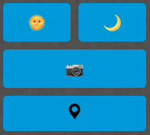
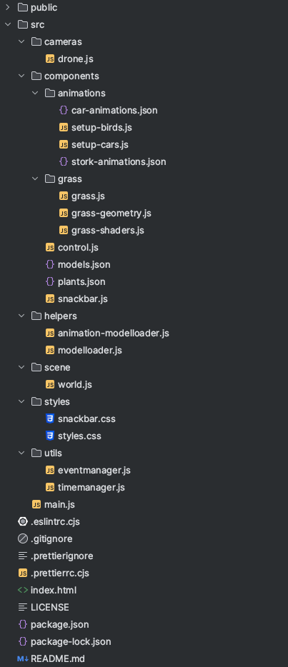
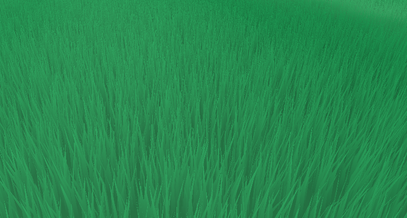

# Inhaltsverzeichnis

- [Nutzerdokumentation](#nutzerdokumentation)
  - [Installation](#installation)
  - [Bedienung](#bedienung)
    - [Tastatur & Maus](#tastaturmaus)
    - [Buttons im User Interface](#buttons)
  - [Weitere Interaktionsmöglichkeiten](#interaktionen)
    - [Tag/Nacht-Wechsel](#tagnacht)
    - [Wechsel der Kamera](#kamera)
    - [Drohne auf Startposition setzen](#startposition)
- [Entwicklerdokumentation](#entwicklerdokumentation)
  - [Arbeitsweise](#arbeitsweise)
    - [Projektmanagement mit ZenHub](#projektmanagement)
    - [Versionsverwaltung](#versionsverwaltung)
    - [Meetings](#meetings)
  - [Code Style](#codestyle)
  - [Designprozess](#designprozess)
    - [Modellierung](#modellierung)
    - [Einbindung der Modelle in three.js](#einbindungThreejs)
  - [Animationen](#animation)
    - [Autos](#autos)
    - [Vögel](#vögel)
    - [Gras](#gras)
  - [Kollisionserkennung](#kollisionserkennung)
  - [Probleme](#probleme)
    - [Performance](#performance)


---
<a name="nutzerdokumentation"></a>
# Nutzerdokumentation
<a name="installation"></a>
## Installation
Um die Anwendung lokal auf dem Gerät laufen zu lassen, müssen Sie die
folgenden Schritte durchführen:
1. Repository klonen/Code herunterladen
2. Dependencies installieren mit `npm install`
3. Anwendung starten durch den Befehl `npm start`

Anschließend wird in der Konsole eine URL ausgegeben, unter der die
Anwendung erreichbar ist. Diese URL kann dann in einem beliebigen
Browser geöffnet werden.

<a name="bedienung"></a>
## Bedienung
Zu Beginn der Anwendung wird der Nutzer in der Szene platziert. Anschließend
hat der Nutzer die Möglichkeit, sich in der Szene umher zu bewegen. Dazu bieten
sich zwei Möglichkeiten:
* Tastatur & Maus
* Buttons im User Interface

<a name="tastaturmaus"></a>
### Tastatur & Maus
Um sich mit Hilfe der Tastatur und Maus in der Szene zu bewegen, muss der Nutzer
zuerst einmal auf die Szene klicken. Dadurch wird die Steuerung gesperrt. 
Anschließend kann der Nutzer sich mit der Hilfe der Tasten WASD in der Szene
bewegen. Dabei bewegt sich der Nutzer in die Richtung, in die er schaut.
Die Tasten R und F ermöglichen es, sich nach oben und unten zu bewegen.
Für die Bewegung der Blickrichtung gibt es wiederum 2 Möglichkeiten:
* Maus
* Pfeiltasten

Um die Steuerung mit der Hilfe der Tastatur wieder zu verlassen, muss nur wieder
mit der Maus geklickt werden. Dadurch wird auch der Mauszeiger wieder sichtbar und 
Buttons können wieder angeklickt werden.

<a name="buttons"></a>
### Buttons im User Interface
Alternativ zur Steuerung mit der Tastatur und Maus kann der Nutzer auch die Buttons
im User Interface verwenden. Dieses ist unten abgebildet. Durch klicken auf diese Buttons kann sich der Nutzer
in allen Bewegungsrichtungen frei bewegen.


<a name="interaktionen"></a>
## Weitere Interaktionsmöglichkeiten
Zusätzlich zur Steuerung der Drohne kann der Nutzer auch noch weitere Aktionen
ausführen. Diese sind im Folgenden aufgelistet:
* Tag/Nacht-Wechsel
* Wechsel der Kamera
* Drohne auf Startpositon setzen



<a name="tagnacht"></a>
### Tag/Nacht-Wechsel
Durch das Klicken auf den Button `Day` oder `Night` kann der Nutzer zwischen Tag und Nacht
wechseln. Dabei wird die Szene entsprechend angepasst. Zum einen wird
die Umgebung auf einen Sternenhimmel bzw. einen Himmel mit Wolken geändert.
Zum anderen ändert sich die Beleuchtung der Szene. Während tagsüber eine
Sonne die Szene beleuchtet, sorgen nachts einzelne, über die Szene verteilte 
Lichtquellen für die Beleuchtung.

<a name="kamera"></a>
### Wechsel der Kamera
Durch das Klicken auf den Button `Camera` kann der Nutzer zwischen den
verfügbaren Kameras hin und her wechseln. Dabei wird die aktuelle Kamera
deaktiviert und die nächste Kamera aktiviert. Die verfügbaren Kameras sind:
* Drohnenkamera
* Debugkamera
* Stationäre Kamera

Dabei ist anzumerken, dass der Nutzer sich ausschließlich mit der Drohnenkamera
in der Szene bewegen kann. Die anderen Kameras sind lediglich dazu da, um
die Szene aus verschiedenen Perspektiven betrachten zu können. Die 
Debugkamera ist dabei so platziert, dass die gesamte Szene auf einmal
zu sehen ist. Die Stationäre Kamera bietet einen realistischen Ausblick auf den
Eiffelturm.

<a name="startposition"></a>
### Drohne auf Startposition setzen
Durch den letzten Button kann die Drohnenkamera wieder auf die Startposition
gesetzt werden. Dies ist vor allem dann hilfreich, wenn der Nutzer sich
in der Szene verirrt hat und nicht mehr weiß, wo er sich befindet.

---
<a name="entwicklerdokumentation"></a>
# Entwicklerdokumentation

<a name="arbeitsweise"></a>
## Arbeitsweise
<a name="projektmanagement"></a>
### Projektmanagement mit ZenHub
Zur Verwaltung der Aufgaben haben wir ZenHub verwendet. Dieses Tool
hat es uns ermöglicht, die Aufgaben in einzelne Tickets zu
unterteilen und diese dann auch zu verfolgen.
In ZenHub haben wir insgesamt 4 Epics erstellt, welche nochmals tiefer unterteilt
waren in einzelne Issues. Folgende Epics haben wir definiert:
* Project Setup
* Initial UI Layout
* User Controls
* Camera and Drone Functionality
* Modelling
* Lighting and Day/Night Cycle
* Interactivity and Fine-Tuning
* Documentation and Presentation

Anschließend wurden diese Epics nochmals unterteilt in einzelne Issues.
Am Ende hatten wir somit insgesamt 58 Issues, welche wir dann in den
folgenden Wochen abgearbeitet haben. Jeder Issue wurde mit einem Titel,
einer Beschreibung, Akzeptanzkriterien und einem Label versehen.

<a name="versionsverwaltung"></a>
### Versionsverwaltung
Um die Arbeit an der Szene zu erleichtern, haben wir uns dazu entschieden,
Git als Versionsverwaltung zu verwenden. Dies hat den Vorteil, dass wir
die Arbeit aufteilen konnten und jeder an seinem Teil der Szene arbeiten
konnte. Gleichzeitig konnten wir so auch die Änderungen der anderen
Teammitglieder verfolgen und bei Bedarf auch Änderungen rückgängig machen.

Jeder Issue aus ZenHub hat einem Branch entsprochen. Nachdem der
entsprechende Code geschrieben wurde, wurde in den `develop`-Branch
mit einer Pull Request gemerged. Diese Pull Requests wurde von 
mindestens einem anderen Teammitglied überprüft und anschließend
entweder freigegeben oder Änderungen wurden vorgeschlagen.

<a name="meetings"></a>
### Meetings
Um die Arbeit an der Szene zu koordinieren, haben wir uns jede Woche
getroffen und die Aufgaben für die kommende Woche besprochen. Dabei
haben wir uns an den Issues orientiert und diese dann auf die einzelnen
Teammitglieder aufgeteilt. Außerdem haben wir uns in diesen Meetings
auch über die bisherige Arbeit ausgetauscht und uns gegenseitig
Feedback gegeben.

<a name="aufbaucode"></a>
## Aufbau des Codes
Insgesamt handelt es sich bei der Gestaltung einer Szene um ein sehr komplexes Projekt.
Dementsprechend ist ein guter Aufbau des Codes sehr wichtig, um den Überblick zu behalten.
Deswegen war uns von Anfang an wichtig, dass der Code gut strukturiert ist und
dass die einzelnen Teile der Szene gut voneinander getrennt sind.

Angefangen hat das ganze mit der Definition eines Code Styles.

<a name="codestyle"></a>
### Code Style
Um einen einheitlichen Code Style über alle Dateien hinweg zu gewährleisten, haben
wir uns dazu entschieden, ESLint zu verwenden. Dieses Tool hilft dabei, den Code
zu überprüfen und Fehler zu finden. Dabei wird auch der Code Style überprüft und
es werden Warnungen ausgegeben, wenn der Code nicht dem gewünschten Code Style
entspricht.

Letztendlich haben wir uns dazu entschieden, folgende Konfiguration für ESLint
zu verwenden:
```
{
  env: {
    browser: true,
    es2021: true,
  },
  extends: ["airbnb-base", "prettier"],
  parserOptions: {
    ecmaVersion: "latest",
    sourceType: "module",
  },
  plugins: ["prettier"],
  rules: {
    "prettier/prettier": "error",
  },
}
```
Orientiert haben wir uns somit am Airbnb Code Style Guide. Dieser ist sehr
ausführlich und bietet viele Möglichkeiten, den Code zu überprüfen.

### Dateistruktur
Das ganze Proejekt konnte selbstverständlich nicht in einer einzigen Datei
implementiert werden. Dies wäre aufgrund der größe des Projekts sehr schnell
unübersichtlich geworden. 

Der gesamte Dateibaum ist nachfolgend abgebildet:



Die wichtigste Datei ist dabei die `index.html`. Diese Datei ist die
Einstiegsdatei in die Anwendung. In dieser Datei wird die Szene initialisiert
und anschließend wird die `main.js` sowie `control.js` eingebunden. Auch die
CSS-Dateien werden in dieser Datei eingebunden.

Die Datei `main.js` ist die zentrale Datei für die Initialisierung der Szene.
In dieser Datei wird die Klasse `World` intialisiert.

Definiert ist die Klasse `World` in der Datei `world.js`. Diese Klasse
ist die zentrale Klasse für die Szene. In dieser werden alle wichtigen
Komponenten der Szene initialisiert. Dazu gehören zum Beispiel die
Kameras und die Drohne, die Beleuchtung und das Laden der Modelle.

Die restlichen Dateien werden nachfolgend kurz beschrieben:
* `control.js` --> Steuerung der Drohne und der Buttons
* `drone.js` --> Definition der Klasse Drohne, mit welcher in der Szene geflogen werden kann
* `setupBirds.js` --> Initialisierung der Animation für die Vögel
* `setupCars.js` --> Initialisierung der Animation für die Autos
* `snackbar.js` --> Definition der Klasse Snackbar --> Anzeige von Meldungen
* `animationModelLoader.js` --> Dynamische Einbindung der animierten Modelle
* `modelLoader.js` --> Dynamische asynchrone Einbindung der Modelle & Defintion der Klasse ModelLoader

Im Ordner `public` sind alle Modelle, Texturen und Bilder gespeichert, die
in der Szene verwendet werden. Dazu gehören insbesondere die Modelle für
den Eiffelturm und den Boden. 


### Klassenstruktur

<a name="designprozess"></a>
## Designprozess
Begonnen hat alles mit der ersten Idee. Unser Ziel war es, den Eiffelturm 
sowie die nähere Umgebung möglichst originalgetreu
nachzubilden. Das Kernstück ist dabei ganz klar der Eiffelturm gewesen, 
weswegen die Suche nach passenden Modellen auch damit begonnen hat.

Gleichzeitig wollten wir aber auch die Umgebung möglichst realistisch und
in einem realistischen Maßstab darstellen. Das bedeutet, dass wir uns
Satellitenaufnahmen der Umgebung herausgesucht haben und diese dann
vermessen haben, um die Maße der Umgebung zu bestimmen. Das Ergebnis
dieser Vermessung ist in den folgenden Abbildungen zu sehen.


Das Ziel war es somit, eine Fläche von 460*740 Metern nachzubilden.

<a name="modellierung"></a>
### Modellierung
Begonnen haben wir damit, den Bodenbereich zu modellieren. Dazu haben wir
eine Ebene erstellt und ebenso wie auf dem Bild zu sehen, die Umrisse der
Umgebung nachgezeichnet. Diese Ebene war somit anschließend eingeteilt in:
* Straße
* Grünfläche
* Gehweg
* Wohngebiet
* Platz für Eiffelturm

Anschließend haben wir die einzelnen Bereiche mit Texturen versehen, um diese
auch optisch voneinander abgrenzen zu können. Das Ergebnis ist in der folgenden
Abbildung zu sehen.


Um die Szene weiter mit Leben zu füllen, haben wir weitere Modelle in die Szene
eingefügt. Das wichtigste Modell ist dabei natürlich der Eiffelturm. Dieser wurde
als erstes Modell in die Szene eingefügt. Anschließend haben wir uns um die
restlichen Modelle gekümmert. Dabei haben wir uns auf folgende Modelle
konzentriert:
* [Eiffelturm](https://sketchfab.com/3d-models/eiffel-tower-model-3d-with-best-quality-c3391c293e70471e9a112f7855adcf2f)
* [Vögel](https://github.com/mrdoob/three.js/blob/dev/examples/models/gltf/Stork.glb)
* [Autos](https://free3d.com/de/3d-model/low-poly-car-40967.html)
* Bäume:
  - https://www.turbosquid.com/3d-models/3d-acacia-tree-vol-15blender-model-2106120
  - https://www.turbosquid.com/3d-models/gentree-105-generic-tree-105-3d-model-2062795
  - https://www.turbosquid.com/3d-models/gentree-103-generic-tree-103-3d-model-2062798
  - https://sketchfab.com/3d-models/low-poly-shrub-small-texture-6e16ec47d7c246a69efffb9e857165ed
  - https://free3d.com/3d-model/small-bush-76246.html
  - https://www.blenderkit.com/get-blenderkit/712109e8-7599-4036-8bc7-d4a25f2d4640/
  - https://www.turbosquid.com/3d-models/callistemon-tree-model-2062119
* Häuser:
  * tbd

<a name="einbindungThreejs"></a>
### Einbindung der Modelle in three.js
Nachdem die Modelle herausgesucht und heruntergeladen wurden, mussten diese
in three.js in die Szene eingebunden werden. Um dies möglichst einfach umzusetzen
und möglichst flexibel zu gestalten, haben wir eine eigene Klasse ModelLoader erstellt.
Diese Klasse ermöglicht es, asynchron Modelle mit Hilfe von JSON-Dateien in die Szene einzubinden.
Dabei wird die JSON-Datei mit den Informationen über das Modell eingelesen und anschließend
werden die einzelnen Objekte des Modells in die Szene eingefügt.

In der JSON-Datei werden dabei folgende Informationen über das Modell gespeichert:
* Dateiname/Dateipfad
* Pro Modell in entsprechender Anzahl des Auftretens in der Szene:
  * Position
  * Rotation
  * castShadow
  * receiveShadow

Somit konnten wir nur anhand der JSON-Datei festlegen, welche Modelle in der Szene
dargestellt werden sollen und wie diese platziert werden sollen. Dies hat den Vorteil,
dass wir die JSON-Datei beliebig anpassen können, ohne dass der Code angepasst werden muss.

<a name="animation"></a>
## Animationen
Um die Szene lebendiger wirken zu lassen, mussten Animationen in die Szene eingebaut werden.
Dabei haben wir uns auf zwei Arten von Animationen fokussiert. 
Zum einen haben wir die Animationen der Autos, die sich auf den Straßen
von Paris hin und her fahren.
Zum anderen haben wir die Animationen der Vögel, die sich in der Luft bewegen
und dabei ihre Flügel bewegen.

<a name="autos"></a>
### Autos
Insgesamt wurden 6 Autos in der Szene platziert. Mit der Hilfe von Keyframes
haben wir die Autos auf den Straßen hin und her fahren lassen. Dabei haben
wir darauf geachtet, dass die Autos nicht zu schnell fahren, damit die
Animation nicht zu unrealistisch wirkt.

Umgesetzt haben wir das ganze mit einer JSON-Datei, in der wir die einzelnen
Keyframes mit den Positionen und Rotationen definiert haben. 
Diese Datei wird bei Start der Szene aufgerufen und so dynamisch die Autos erzeugt.
Das heißt es ist nicht fest in den Code eingebaut, wie viele Fahrezuge dargestellt werden,
sondern es wird die Anzahl der Autos aus der JSON-Datei ausgelesen und dann 
dementsprechend viele Autos erzeugt.

Diese JSON-Datei sieht folgendermaßen aus:
```
{
  "0": {
    "rotation": [0, 0, 0.5, 1, 1, 1.5, 2],
    "time": [0, 25, 27.5, 30, 45, 47.5, 50],
    "positions": [255, 0, -450, 255, 0, -10, 265, 0, -10, 275, 0, -10, 275, 0, -450, 265, 0, -450, 255, 0, -450]
  },
  "1": {
    "rotation": [1, 1, 1.5, 2, 0, 0.5, 1],
    "time": [0, 20, 22.5, 25, 45, 47.5, 50],
    "positions": [275, 0, -10, 275, 0, -450, 265, 0, -450, 255, 0, -450, 255, 0, -10, 265, 0, -10 ,275, 0, -10]
  },
  "2": {
    "rotation": [0, 0, 0.5, 1, 1, 1.5, 2],
    "time": [0, 22.5, 25, 27.5, 52.5, 55, 57.5],
    "positions": [10, 0, -450, 10, 0, -10, 20, 0, -10, 30, 0, -10, 30, 0, -450, 20, 0, -450, 10, 0, -450]
  },
  "3": {
    "rotation": [1, 1, 1.5, 2, 0, 0.5, 1],
    "time": [0, 15, 17.5, 20, 52.5, 55, 57.5],
    "positions": [30, 0, -10, 30, 0, -450, 20, 0, -450, 10, 0, -450, 10, 0, -10, 20, 0, -10, 30, 0, -10]
  },
  "4": {
    "rotation": [0, 0, 0.5, 1, 1, 1.5, 2],
    "time": [0, 25, 27.5, 30, 50, 52.5, 55],
    "positions": [500, 0, -450, 500, 0, -10, 510, 0, -10, 520, 0, -10, 520, 0, -450, 510, 0, -450, 500, 0, -450]
  },
  "5": {
    "rotation": [1, 1, 1.5, 2, 0, 0.5, 1],
    "time": [0, 20, 22.5, 25, 50, 52.5, 55],
    "positions": [520, 0, -10, 520, 0, -450, 510, 0, -450, 500, 0, -450, 500, 0, -10, 510, 0, -10, 520, 0, -10]
  }
}
```
Jeder key stellt dabei ein Auto dar. In den einzelnen keys werden dann die
Positionen, die Zeiten und die Rotationen der einzelnen Keyframes definiert. 
Dabei ist zu beachten, dass die einzelnen Werte immer in Dreiergruppen
angegeben werden. Das heißt, dass die ersten drei Werte der `positions` die Positionen des
ersten Keyframes darstellen (also x, y, z), die nächsten drei Werte die Positionen des
zweiten Keyframes und so weiter.

<a name="vögel"></a>
### Vögel
Ähnlich zum Aufbau der Autos wurden auch die Vögel animiert. Auch hier wurden
die einzelnen Keyframes in einer JSON-Datei definiert und anschließend
dynamisch erzeugt. Ein Unterschied besteht jedoch darin, dass die Vögel
nicht nur bezüglich Rotation und Position animiert wurden, sondern auch
die Flügelbewegung wurde mit animiert. Dies war ein Teil des Modells, 
welches wir uns aus dem Internet heruntergeladen haben. In der Umsetzung im 
Programmcode mussten diese zwei separaten Animationen dann zusammengeführt werden.
Somit haben die Vögel unabhängig voneinander zwei Actions, die sie ausführen.

<a name="gras"></a>
### Gras
Um die Szene noch lebendiger wirken zu lassen, haben wir uns dazu entschieden,
auch das Gras auf den Grünflächen zu animieren. Dies haben wir mit Hilfe von
Shadermaterialien umgesetzt. Dabei haben wir ein Shadermaterial erstellt, welches
die einzelnen Grashalme animiert. Dieses Shadermaterial wird dann auf die
Grasflächen angewendet. Trotz der großen Anzahl an Grashalmen
konnten wir so die Performance der Szene aufrechterhalten.
Das Ergebnis ist in der folgenden Abbildung zu sehen.


<a name="kollisionserkennung"></a>
## Kollisionserkennung
Damit die Drohnenkamera nicht durch Objekte fliegen kann, musste eine
Kollisionserkennung implementiert werden. Um dies möglichst performant
umzusetzen, haben wir uns dazu entschieden, Raycasting zu verwenden.
Dabei wird ein Strahl von der Drohnenkamera ausgesendet und anschließend
überprüft, ob dieser Strahl mit einem Objekt kollidiert. Ist dies der
Fall, so wird die Bewegung der Drohnenkamera in die entsprechende Richtung
verhindert. 

In der Konsequenz führt das dazu, dass die Drohne nicht durch Objekte fliegen
kann.

<a name="probleme"></a>
## Probleme
<a name="performance"></a>
### Performance
Ein Problem, welches wir während der Entwicklung der Szene immer wieder
hatten, war die Performance. Aufgrund der Größe der Szene und der Anzahl
der Objekte, die in der Szene dargestellt werden, musste in vielen Teilen
der Szene auf die Performance geachtet werden. Dies war vor allem bei
der Auswahl der Objekte und Oberflächen wichtig. So haben wir zum Beispiel
bei den Bäumen darauf geachtet, dass diese nicht zu viele Polygone haben,
um die Performance nicht zu sehr zu beeinträchtigen. Auch bei der Auswahl
der Häuser und Autos haben wir darauf geachtet, dass diese nicht zu hoch aufgelöst
sind und somit zu viel Rechenleistung benötigen.

Auch die Kollisionserkennung ist in diesem Kontext zu nennen. Da wir
die Kollisionserkennung mit Hilfe von Raycasting umgesetzt haben, mussten
wir darauf achten, dass dafür ein möglichst effizienter Algorithmus 
verwendet wird. Dieser Algorithmus ist in `three-mesh-bvh` vorhanden.
Diese Library hat es uns ermöglicht, eine Kollisionserkennung
performant umzusetzen, ohne dabei riesige Bounding Boxen zu verwenden.
Stattdessen war es uns dadurch möglich, die tatsächlichen Formen der
Objekte als Kollisionsobjekte zu verwenden.